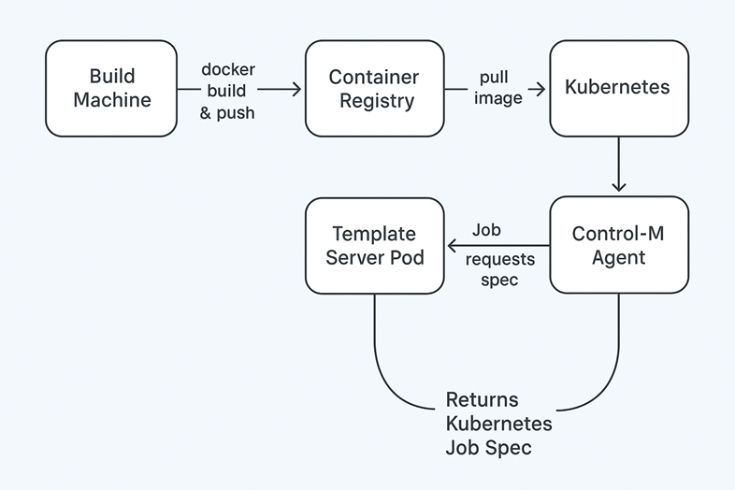

Deploying a Containerized Remote Spec Service for a Control-M Kubernetes Agent
===========================================================================

## Introduction
This tutorial demonstrates how to build an OCI image for a simple template server, deploy it using Helm, and use it for Control-M Kubernetes jobs of type Remote web service.

OCI (Open Container Initiative) is the standard for container image formats and runtimes to ensure interoperability and consistency across container tools. This tutorial uses Docker for building the image, but any OCI-compliant tool can be used instead.

In this tutorial, you run a Control-M Kubernetes-type job. When the job is executed, the Control-M/Agent requests a Job specification from the server by specifying a template and parameters. The server generates the template using those parameters and returns a complete and usable Kubernetes Job specification.

The following diagram illustrates the deployment flow:



In this diagram, you can see the following main deployment flow components:
- Build Machine: Builds and pushes the Docker image
- Container Registry: Stores the tpl-server image
- Kubernetes Cluster: Runs a Helm Chart, which deploys a Template Server Pod and generates the /jobspec service
- Control-M Agent: Runs the RemoteSpec job

## 🔧 Prerequisites
Before you begin, ensure you have the following tools installed and configured:
- Docker: https://docs.docker.com/get-docker/
- Kubernetes (with kubectl): https://kubernetes.io/docs/tasks/tools/
- Helm: https://helm.sh/docs/intro/install/
- Access to a Control-M environment, including an agent deployed in the Kubernetes cluster

## 🚀 Begin
1. Build the OCI image by running the following command:
```bash
docker build -t tpl-server:latest image
```
This packages your template server into a portable container image that can run anywhere.

2. Ensure that you now have the image by running:
```bash
docker images | grep tpl-server
```

3. Publish the image:
```bash
docker tag tpl-server:latest <my-repo>/tpl-server:latest
docker push <my-repo>/tpl-server:latest
```
This enables Kubernetes to pull the image from a registry accessible to the cluster.

4. Ensure that the image is published by running:
```bash
docker pull <my-repo>/tpl-server:latest
```

5. Download the sample files of the remote job specification:
https://github.com/controlm/ctm-kubernetes/tree/remote-tpl/01-Remote_Job_Specification_sample

6. Customize the `chart/values.yaml` file. Under the `image:` element, provide your repository name:
```yaml
repos: <my-repo>
```

7. In Kubernetes, create a pod using Helm:
```bash
helm install my-template-server ./chart
```

8. Check pod status:
```bash
kubectl get pods
kubectl describe pod <pod-name>
```

9. In Control-M, create a Kubernetes-type centralized connection profile:
- Name: K8STPLSVC
- Namespace: your namespace
- Spec Endpoint URL: `http://my-template-server-svc/jobspec`

10. Customize the `RemoteSpec_demoJob.json` file with your environment details. Update `ControlmServer`.

11. Run the Kubernetes job via Automation API:
```bash
ctm run RemoteSpec_demoJob.json
```

## What Happens When the Control-M Job Runs
During execution of the Control‑M RemoteSpec job, Control‑M sends a request to the Template Server (the provided Flask app running `tplserver.py`). The Template Server loads the requested template file (e.g., `demo.yaml`) and injects into it the values provided in the job’s Spec Request Parameters.

Using Flask’s `render_template()`, the server generates a rendered Kubernetes Job spec (YAML), with all placeholders replaced by the passed parameter values.

## 🛠️ Troubleshooting
Common issues and fixes:
- **ImagePullBackOff**: Verify the image name and tag, and ensure the registry is reachable and authenticated.
- **Helm install fails**: Ensure `values.yaml` contains the correct repo and tag.

To check pod logs:
```bash
kubectl logs <pod-name>
```
